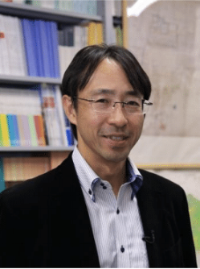
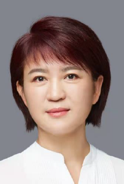

---
hide:
  - navigation
---

# Conference Programs

The conference program table is out now! The schedule during the conference is provided as follows (please note that minor changes may still occur):

## Keynote Speakers

### Prof. Hiroki TANIKAWA

> Professor Hiroki Tanikawa is a distinguished member of the Graduate School of Environmental Studies at Nagoya University, where he serves in the Department of Environmental Engineering and Architecture. Professor Tanikawa's research interests span a variety of topics, including material stock flow analysis, city-scale environmental assessment, and sustainability. His work focuses on the environmental weight of cities, urban stock analysis, de-materialization, and de-carbonization. Recognized for his contributions to environmental systems and planning, Professor Tanikawa has held various academic positions and memberships, contributing significantly to both national and international academic communities. His research projects and publications have garnered numerous awards, reflecting his commitment to advancing sustainable urban development.   
> 
> You can view his full profile [here](https://profs.provost.nagoya-u.ac.jp/html/100003784_en.html).

- Keynote name: Weight of the Society - Climate Change and Sustainable Stock-type Society
- Abstract: Can Japan’s material stock be left as an asset for future generations? Climate change, declining birth rates, and an aging society are already underway. We are preparing to plan for society in 2050, which was thought to be a distant future. This article summarizes the concept of a stock-type society that accumulates many assets that will enrich the next generation. It discusses establishing a stock-type society from many perspectives based on existing research.

### Dr. FANG Li

> Dr. FANG Li is Chief Representative of WRI (USA) Beijing Representative Office. WRI’s mission WRI’s mission is to move human society to live in ways that protect Earth’s environment and its capacity to provide for the needs and aspirations of current and future generations.
> 
> Prior joining WRI, Dr. Fang was the Deputy Director General of Foreign Economic Cooperation Office of the Chinese Ministry of Ecology and Environment, where she led diverse multidisciplinary teams working on a wide range of environmental issues, such as Biodiversity and Minamata Conventions, environmental performance evaluation, environmental and climate finance, etc. She also served as the Assistant Secretary General of the China Council for International Cooperation on Environment and Development (CCICED), a unique high-level think tank that brings together top Chinese and foreign experts and provides research and policy recommendations to the Chinese government. There she was responsible for developing strategy and research frameworks, mobilizing resources, and coordinating the joint activities of participating countries, international organizations, NGOs and governmental agencies. She established the Environmental Financial Center, set up CCICED Special Policy Study on Green Finance and promoted policy implementation.
> 
> Her other previous positions included serving as Division Director in the International Cooperation Department of the Environment Ministry of China, in charge of inter-governmental bilateral and multilateral regional cooperation as well as WTO environmental and trade negotiation, and worked in Ecuador as for a Chinese-foreign mining joint venture.
> 
> Dr. Fang earned a Ph.D. in environmental economics from China’s renowned Renmin University with a focus on environmental finance, valuation of nature, and emissions trading. She holds two BA degrees from Tianjin University in chemical engineering and business management.