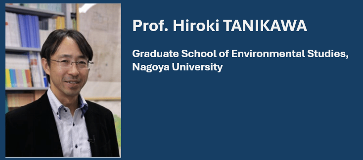

---
hide:
  - navigation
---

# Conference Programs

The conference program table is out now! The schedule during the conference is provided as follows (please note that minor changes may still occur):

## Keynote Speakers

### Prof. Hiroki TANIKAWA

- Keynote name: Weight of the Society - Climate Change and Sustainable Stock-type Society
- Abstract: Can Japan’s material stock be left as an asset for future generations? Climate change, declining birth rates, and an aging society are already underway. We are preparing to plan for society in 2050, which was thought to be a distant future. This article summarizes the concept of a stock-type society that accumulates many assets that will enrich the next generation. It discusses establishing a stock-type society from many perspectives based on existing research.

### Dr. FANG Li

### Dr. Heinz Schandl

### Prof. Hung Suck Park

