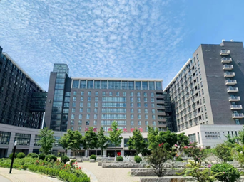
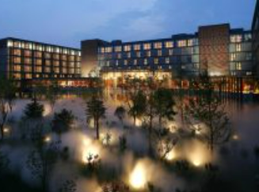

---
hide:
  - navigation
---

# Venue & Travel

## Conference Venues Locations

### Zhongguan Xinyuan Global Village PKU Beijing (北京大学中关新园)

Zhongguan Xinyuan Global Village PKU Beijing is located in Zhongguancun North Street, near entrance C of Peking University East Gate Station of Metro 4, and adjacent to Peking University, Tsinghua University, summer palace and Zhongguancun business district.

- Address: 126 Zhongguancun North Street

    <iframe src="https://www.google.com/maps/embed?pb=!1m18!1m12!1m3!1d10814.279868491565!2d116.30784174159498!3d39.9940337908355!2m3!1f0!2f0!3f0!3m2!1i1024!2i768!4f13.1!3m3!1m2!1s0x35f056ac64b7cf1d%3A0x63d6bea0b79d68c7!2sZhongguan%20Xinyuan%20Global%20Village%20PKU!5e0!3m2!1sen!2sus!4v1706670614804!5m2!1sen!2sus" width="600" height="450" style="border:0;" allowfullscreen="" loading="lazy" referrerpolicy="no-referrer-when-downgrade"></iframe>

- Tel: +86-10-62752288
- Fax: +86-10-62752870

## Travel Directions

> We recommend you to take the subway or a taxi for your transportation.

The venue is near `entrance C of Peking University East Gate Station of Metro 4`, you can reach it by heading south 100 meters from Exit C. Information on subway transfers can be found on the Beijing Subway website: [https://www.bjsubway.com/en/](https://www.bjsubway.com/en/).

The `distances and estimated costs` from the airport or train stations to the conference venue (prices subject to change):

- Beijing Capital International Airport: 33 kilometers, by taxi: 50 minutes, 110 RMB.
- Beijing Daxing International Airport: 60 kilometers, by taxi: 60 minutes, 150 RMB.
- Beijing South Railway Station: 21 kilometers, by taxi: 45 minutes, 63 RMB.
- Beijing West Railway Station: 15 kilometers, by taxi: 30 minutes, 50 RMB.
- Beijing Railway Station: 21.5 kilometers, by taxi: 50 minutes, 70 RMB.
- Beijing North Railway Station: 11.5 kilometers, by taxi: 20 minutes, 35 RMB

## Accommodation

The Zhongguan Xinyuan Global Village PKU Beijing hotel **set aside a block of rooms for the conference attendees**, with 100 rooms in Villa 1 and 100 rooms in Building No. 9.

Kindly be aware that the hotel expenses are to be covered by yourself.

### Zhongguan Xinyuan Global Village PKU Beijing (北京大学中关新园)

Zhongguan Xinyuan Global Village PKU Beijing is located in Zhongguancun North Street, near entrance C of Peking University East Gate Station of Metro 4, and adjacent to Peking University, Tsinghua University, summer palace and Zhongguancun business district.

It is an important part for Peking University to build a world-class university. It is a comprehensive park integrating accommodation, catering, conference, teaching and recreational services. It has expert apartments, international students apartments, postdoctoral apartments and a star hotel.

- Address: 126 Zhongguancun North Street, near entrance C of Peking University East Gate Station of Metro 4
- Hotel Reservation Telephone: +86-10-62752288
- Website: http://www.globalvillagepku.com/

#### Zhongguan Xinyuan Global Village PKU Beijing (Villa 1)

The venue is located within the hotel.

Price per night, per person/room from 658 RMB --, including breakfast

#### Zhongguan Xinyuan Global Village PKU Beijing (No. 9 building)

Distance to the conference venue: 300 meters, a 5-minute walk to the venue

Price per night, per person/room from 558 RMB --, including breakfast

### How to Book

You can contact the hotel directly via the website link or phone number provided above to book your room. Alternatively, you can book through us to receive a discount (limited quantity) by filling out this form:

<iframe src="https://docs.google.com/forms/d/e/1FAIpQLSdS__Q7o3mlPvLMQKReyJUnL7R8mqJYbiyoAnWTD5ltFexSOQ/viewform?embedded=true" width="640" height="480" frameborder="0" marginheight="0" marginwidth="0">Loading…</iframe>

If the quantity limit is reached, we will promptly notify you and assist with rearranging your accommodation.

 

> We also selected some hotels near the venue which you can book during the conference.

### The Lakeview Hotel Beijing (北大博雅国际酒店)

Located in the Zhongguancun, often referred to as "China's Silicon Valley," The Lakeview Hotel Beijing (Beida Boya Guoji Huiyi Zhongxin) is situated close to famous Beijing attractions including Yuanming Yuan and the Summer Palace. On offer in The Lakeview Hotel Beijing are a great variety of rooms.

- Address: No. 127 Zhongguancun North Street, Haidian District, Beijing
- Distance to the conference venue: 1000 meters, a 15-minute walk to the venue
- Price per night, per person/room from 1056RMB --, including breakfast
- Hotel Reservation Telephone: +86-20-86007566

### Wenjin Hotel Beijing (北京文津国际酒店)

Wenjin Hotel Beijing(Beijing Wenjin Guoji Jiudian), located in Tsinghua Science & Tech Park, is in the heart of Zhongguancun, known as the Silicon Valley of China. Bordering Tsinghua University in the north and Peking University in the west, this Beijing hotel is minutes from Summer Palace, Yuanming Garden and a dozen well-known multinational companies' headquarters in China.

- Distance to the conference venue: 778 meterrs, a 11-minute walk to the venue
- Address: Building 5, No. 1 Courtyard, Zhongguancun East Road, Haidian District, Beijing
- Price per night, per person/room from 1200RMB --, including breakfast
- Hotel Reservation Telephone: +86-20-86007566
