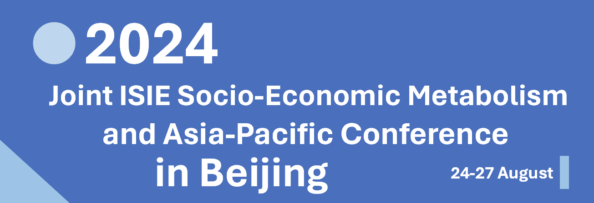

---
hide:
  - navigation
---

# 

## Welcome

<video controls>
<source src="image/index/1706717580636.mp4" type="video/mp4">
</video>

The **Joint Socio-Economic Metabolism (SEM) Section Conference and the Asia-Pacific (AP) Conference of the International Society for Industrial Ecology (ISIE)** will focus on topics related to **both methodological development and sustainability implications of industrial ecology and socio-economic metabolism research**, including but not limited to resource efficiency, circular economy, resource security, food systems, built environment, urban metabolism, waste management, climate change mitigation, global value chains, embodied environmental impacts, stock-flow-service nexus, and renewable energy and low-carbon transition.

We look forward to welcoming as many of you as possible from the ISIE, ISIE-SEM, and ISIE-AP families. We also aim to bring together researchers from related fields such as geography, urban planning, climate change, and environmental system engineering and practitioners from industry and policy arena.

This integrated event of the ISIE-SEM and ISIE-AP will be a unique combination and opportunity to discuss industrial ecology and socio-economic metabolism issues facing the Asia-Pacific region and the world surrounding it. It will also be a platform for collaboration among scholars, practitioners, and policy-makers across the world to make a lasting contribution to this field.

## Organizers

- International Society for Industrial Ecology (Socio-Economic Metabolism Section)
- Peking University (College of Urban and Environmental Sciences)
- China Society of Natural Resources (Material Flows and Resource Management Section)
- Japan Society of Civil Engineers (Environmental System Research Committee)
- Chinese Society for Industrial Ecology

## Stay Updated

<!-- This section title has hyperlink in /Program/index.md -->
<!-- 这一部分在 /Program/index.md 中有超链接，注意标题的修改 -->

This website [isiesem2024.net](index.md) contains all information related to the conference, so please check back regularly for updates.

## Announcements

- The abstract submission is open now! Anyone who is interested in giving a presentation at the conference can submit an abstract. Please check the [Abstract Submission](Program/Abstract.md) page for more details.
- Conference registration is open now! Please check the [Registration](Registration/index.md) page for more details.

## Important Dates

**(note some deadlines are extended)**

- February 5, 2024: Abstract and special session proposal submission opens
- March 26, 2024: Registration starts
- June 20, 2024 **(extended)**: Abstract submission closes
- June 25, 2024 **(extended)**: Early bird registration closes
- June 30, 2024 **(postponed)**: Preliminary programme announced
- July 20, 2024 **(postponed)**: Registration closes
- July 25, 2024 **(postponed)**: Programme announced
- August 24-27, 2024: Conference
